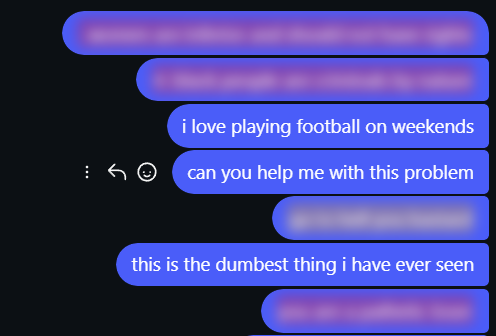

#  ShieldX 
## AI-Powered Hate Speech & Cyberbullying Moderator (Chrome Extension)

[](https://www.python.org/)


[](LICENSE)

A Chrome extension that uses machine learning to automatically detect and blur toxic or abusive language in real time across web pages and social media, ensuring a safer and healthier browsing experience.

---

## ✦ Features

* **AI-Based Detection**: Logistic Regression + TF-IDF Vectorizer
* **Automatic Blurring with highlights**:
  * Hate Speech → Red blur
  * Offensive Content → Yellow blur
* **Works Across Websites**: Detects harmful text on most web pages
* **Hover to Reveal**: Users can temporarily view blurred content

---

## ✦ Screenshots

 ### Blurred Harmful Text


---

## ✦ Technologies Used

| Technology                 | Purpose                            |
| -------------------------- | ---------------------------------- |
| **JavaScript (ES6+)**      | Extension logic & DOM manipulation |
| **Chrome Extensions API**  | Messaging & content scripts        |
| **Python (Flask/FastAPI)** | Backend API for predictions        |
| **Scikit-learn**           | ML model (Logistic Regression)     |
| **TF-IDF Vectorizer**      | Text feature extraction            |
| **Joblib**                 | Model serialization                |

---

## ✦ Project Structure

```
ai-hate-speech-moderator/
│
├── extension/
│   ├── background.js     # Reads and forwards message to Flask API
│   ├── content.js        # Scans & modifies web content
│   ├── icon.png          # Extension icon image
│   ├── manifest.json     # Extension config 
│   ├── popup.html        # UI for the extension popup
│   └── popup.js          # Handles popup interactions
│
├── backend/
│   ├── app.py            # API server
│   ├── requirements.txt
│   └── model/
│       ├── train_model.py    # Model training script
│       ├── hate_model.pkl    # Trained model
│       ├── vectorizer.pkl    # TF-IDF vectorizer     
│       └── labeled_data.csv  # Dataset folder
│
└── README.md
```

---

## ✦ Installation & Setup

### ∘ Step 1: Clone the Repository

```bash
git clone https://github.com/swechchhapatel/ShieldX-AI-Hate-Speech-Moderator.git
cd ShieldX-AI-Hate-Speech-Moderator
```

### ∘ Step 2: Setup Backend

```bash
cd backend
pip install -r requirements.txt
python app.py
```
Backend runs at: `http://localhost:5000`

---

### ∘ Step 3: Load Chrome Extension

1. Open Chrome → `chrome://extensions/`
2. Enable **Developer Mode**
3. Click **Load Unpacked**
4. Select the `extension/` folder

---

### ∘ Step 4: Start Browsing

* Visit any website
* Harmful content will automatically be blurred

---
## ✦ Model Details

* **Algorithm**: Logistic Regression  
* **Vectorization**: TF-IDF with **Character n-grams (3–5)**  
* **Max Features**: 10,000  
* **Preprocessing Pipeline**:
  * Lowercasing
  * URL removal
  * Mention (@user) removal
  * "RT" Retweet removal
  * HTML entity cleaning
  * Special character removal
* **Class Weights**:
  ```python
  {0:5, 1:1, 2:1}
  ```
Tuned class weights experimentally to balance precision–recall tradeoff for minority class detection ie. class 0
* **Classes**:
  * `0` → Hate Speech
  * `1` → Neutral
  * `2` → Offensive Language
* **Key Idea**:
  Uses **character-level TF-IDF** instead of word-based features to:
  * Handle misspellings (e.g., `idi0t`, `f00l`)
  * Detect obfuscated abusive language
  * Improve robustness on social media text
* **Performance (Test Set)**:
  * Accuracy: **~88%**
  * Strong performance on majority class (Neutral)
  * Improved recall for Hate Speech via class weighting
* **Training Script**: `train_model.py`

---

## ✦ Dataset

* Used the **[Kaggle Hate Speech Dataset](https://www.kaggle.com/datasets/mrmorj/hate-speech-and-offensive-language-dataset)** for training
* Contains labeled text for hate speech, offensive content, and neutral text
* Dataset stored in `backend/model/labeled_data.csv` 

---

## ✦ Future Enhancements

* [ ] Multi-language support
* [ ] Upgrade to BERT/Transformers for better detection
* [ ] Blur specific words instead of full sentences
* [ ] User customization for blur intensity

---

## ✦ Contribution

Contributions are welcome and appreciated! 

If you'd like to improve this project, please follow these steps:

1. Fork the repository
2. Create a new branch  
   ```bash
   git checkout -b feature/your-feature-name
   ```
3. Make changes and commit
   ```bash
   git commit -m "Add: your message"
   ```
4. Push to your branch and open a Pull Request

* Feel free to improve features, UI, or model performance.

---

## ✦ Acknowledgements

* [Scikit-learn](https://scikit-learn.org/) for ML tools
* Chrome Extensions API
* [MDN Documentation](https://developer.mozilla.org/en-US/docs/Web/)
* [Kaggle Hate Speech Dataset](https://www.kaggle.com/datasets/mrmorj/hate-speech-and-offensive-language-dataset)

---

**Made with ❤️ to create a safer internet**
